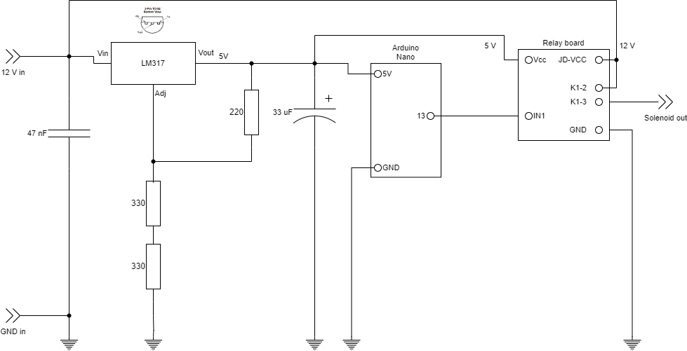

# PTO control
Electronical soft start of the PTO of a New Holland TL-90 with a non functional mechanical soft start

## Schematic
The wire going to the solenoid is cut. One end, the 12 V in line, is connected to the input of the board. The other end, Solenoid out, will control the solenoid. The board will only have power supply when the PTO function is active. When PTO is off, the board is switched off which should be safe.

